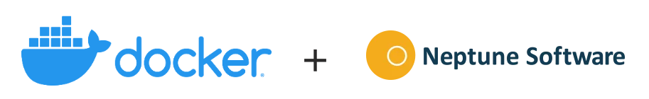

[Visit Official Website](https://www.google.com)

[Visit Official Documentation](https://community.neptune-software.com/documentation/planet9)

## DOCKER-COMPOSE
### RUN
```
$ docker-compose up
```

### STOP
```
$ docker-compose down
```

## General

| Name | Default | Description | Supported |
| ---  | -----   |  ------  |----------|
| NODE_ENV  | production | In general use production, development translates in verbose logging.   | ≥v2.0.4   |
| NAME      | Planet 9 | The application/instance name   | ≥v2.0.4   |
| DESCRIPTION  | Installation | The initial default password for the admin user.   | ≥v2.0.4   |
| INITIAL_ADMIN_PASSWORD  | admin |	In general use production, development translates in verbose logging.   | ≥v2.0.4   |
| SESSION_TIMEOUT  | 180 |	User session timeout in minutes   | ≥v2.0.4   |
| INSTANCES  | 2 |	The number of child processess that P9 should start up with   | ≥v2.0.4   |
| PORT  | 8080 |	Set port use in localhost   | ≥v2.0.4   |
| BACKGROUNDJOB_INTERVAL | 60 |	How often the engine should check to see if there are any jobs to run (in seconds) | ≥v2.0.4 |
| P9_MODULES_PATH |	. |	The path to the folder where custom NPM modules are located and should be installed | ≥v2.1.0 |
| HTTP_RESPONSE_TIMEOUT | 120 | HTTP response timeout of Planet 9 in seconds | ≥v2.6.0 |


## SSL

| Name | Default | Description | Supported |
| ---- | ------- | ----------- | --------- |
| ENABLE_SSL | false | Run Planet9 in HTTPS mode. | ≥v2.0.4 |
| SSLCA | Empty | The SSL certificate authority. (Required if SSL enabled and a SSL Certificate Authority is issued.) |	 ≥v2.0.4 |
| SSLCERT | Empty String | The SSL certificate. (Required if SSL enabled) | ≥v2.0.4 |
| SSLKEY | Empty String | The SSL private key. (Required if SSL enabled) | ≥v2.0.4 |
| SSLPASSPHRASE | Empty String | The SSL passphrase (Required if SSL enabled and a passhrase is required) | ≥v2.0.4 |
| SSL_PORT | 8081 | The port to bind on for SSL. (Required if SSL enabled) | ≥v2.0.4 |

## NodeJS

| Name | Docs |
| ---- | ---- |
| NODE_EXTRA_CA_CERTS | Docs |
| NODE_TLS_REJECT_UNAUTHORIZED | Docs |
| OPENSSL_CONF | Docs |
| SSL_CERT_DIR | Docs |
| SSL_CERT_FILE | Docs |

## Database

Supported Databases
PostgreSQL (v9.6 - v11) - (Not v12 !)
MS SQL/ Azure SQL
More to come...
Important: For more production-like environments, we suggested to use any other DB type aside from SQLite.

## Configure SQLite

| Name | Default | Description | Supported |
| ---- | ------- | ----------- | --------- |
| DB_TYPE | sqlite | No need to specify as it's the default | ≥2.0.4 |
| DB_SQLITE_PATH | ./db/planet9.sqlite | Path for the SQLite DB with all the Planet9 state. | ≥v2.1.0 |
| DB_SQLITE_ENTITIES_PATH | ./db/planet9-entities.sqlite | Path for the SQLite DB with all the entities data (from the Tools > Database) | ≥v2.1.0 |

## Configure PostegreSQL

| Name | Default | Description | Supported |
| ---- | ------- | ----------- | --------- |
| DB_TYPE |	sqlite | Set to postgresql | ≥2.0.4 |
| DB_URI_POSTGRES | Empty String | The URI for the database. If this is set, other POSTGRES options are ignored | ≥2.0.4 |
| DB_PSQL_HOST | localhost | Database host name/IP | ≥2.0.4 |
| DB_PSQL_PORT | 5432 |	Database port | ≥2.0.4 |
| DB_PSQL_USER | Empty String |	DB user | ≥2.0.4 |
| DB_PSQL_PASSWORD | Empty String |	DB password | ≥2.0.4 |
| DB_PSQL_SSL | false |	Enable SSL mode for the database | ≥2.0.4 |
| DB_PSQL_DBNAME | Planet9 | The database name (case sensitive!) | ≥2.0.4 |

Configure MS SQL/Azure SQL
Supported from v2.1.0

The target database must have a schema named planet9 (unless configured otherwise) before connecting a Planet 9 instance to it. For more information regarding this consult the "Planet 9 installation guide". If the database is empty, Planet 9 will initialize all required tables and data on startup.

| Name | Default | Description | Supported |
| ---- | ------- | ----------- | --------- |
| DB_TYPE |	sqlite | Set to mssql | ≥2.0.4 |
| DB_MSSQL_HOST | localhost | Database host name/fqdn/IP | ≥v2.1.0 |
| DB_MSSQL_PORT | 1433 | Database port | ≥v2.1.0 |
| DB_MSSQL_USER | Empty String | DB user | ≥v2.1.0 |
| DB_MSSQL_PASSWORD | Empty String | DB password | ≥v2.1.0 |
| DB_MSSQL_SCHEMA |	planet9 |  | ≥v2.1.0 |
| DB_MSSQL_DBNAME | planet9 | The database name | ≥v2.1.0 |
